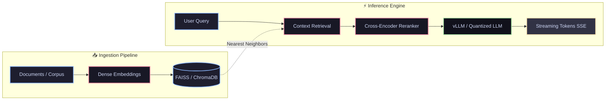

<div align="center">

# 🌌 **IQROGUEREX**

<!-- 🔥 High-Contrast Dynamic Cyber Header Animation -->


<!-- ⚡ Multi-Phrase Terminal Typing Animation -->


<br/>

<!-- 🛡️ Reactive Glow Status Shields -->
[](https://github.com)
[](https://pytorch.org/)
[](https://fastapi.tiangolo.com/)
[](https://aws.amazon.com/)

<br/>

 _“No amount of money ever bought a second of time.”_

</div>

---

```python
class IQROGUEREX:
    def __init__(self):
        self.role = "AI/ML Systems & Core Deep Learning Engineer"
        self.domains = [
            "Decoder-Only Transformers",
            "Dense Vector RAG & FAISS",
            "Quantized Local Inference (GGUF/AWQ)",
            "High-Throughput Streaming Engines"
        ]
        self.stack = ["PyTorch", "Hugging Face", "FastAPI", "React", "AWS"]

    def operational_status(self) -> str:
        return "Converging loss functions, optimizing tokens/sec, and shipping production models."
```
---

## 🔬 Core Focus & Research

| Focus Area | Core Stack & Architectures | Operational Execution |
| :--- | :--- | :--- |
| **🧠 Deep Learning & Modeling** | `Decoder-Only Transformers` `LoRA` `QLoRA` `FlashAttention` | Custom pre-training & PEFT pipelines |
| **⚡ Retrieval-Augmented Generation** | `FAISS` `ChromaDB` `Dense Embeddings` `Cross-Encoders` | Multi-stage hybrid search & re-ranking |
| **⚙️ Local LLMs & Acceleration** | `Ollama` `vLLM` `TensorRT-LLM` `GGUF` `AWQ` | Low-bit quantization & low-latency inference |
| **🌐 Production Engineering** | `FastAPI` `SSE / WebSockets` `AWS Serverless` `Docker` | Async streaming tokens & scale-to-zero microservices |

---

## 🛠️ Technical Arsenal

### 🧠 Deep Learning, Vectors & Model Deployment

<p align="left">
  
  
  
  
  
  
  
  
</p>


---
### 🌐 Cloud Architecture, APIs & Interfaces

<p align="left">
  
  
  
  
  
  
  
  
  
</p>

---

## 📈 Engineering Analytics

<div align="center">
  <table>
    <tr>
      <td align="center" width="450">
        
      </td>
      <td align="center" width="450">
        
      </td>
    </tr>
  </table>
  <br/>
  
</div>

---

## 🌐 Connect & Network

<div align="center">

[](https://www.linkedin.com/in/chinmay-chatradamath-356b74429)

<br/>

 _“Whatever in creation exists without my knowledge exists without my consent.”_

</div>
